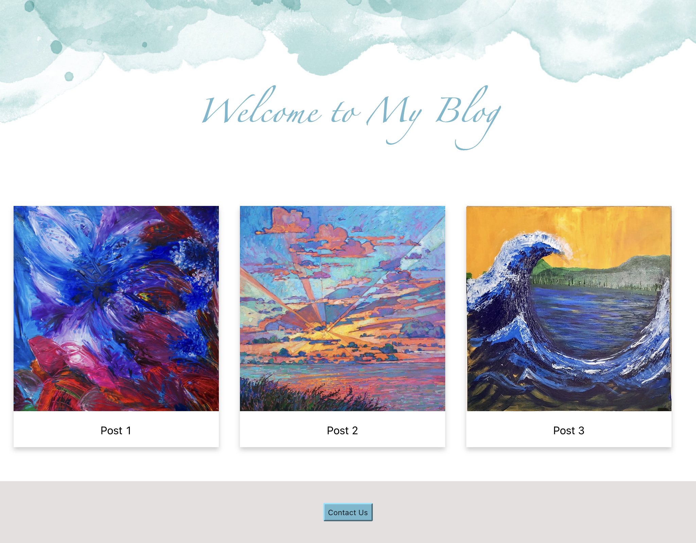

# React Components Lab
Create a personal blog website using React components similar to the below image. Your website should contains at least three components:
- Header
- Post
- Footer
The Post component will represent one post only, and more posts could be added using the same component.
 
<i>Hint: use props to be able to change the content of the posts.</i>

